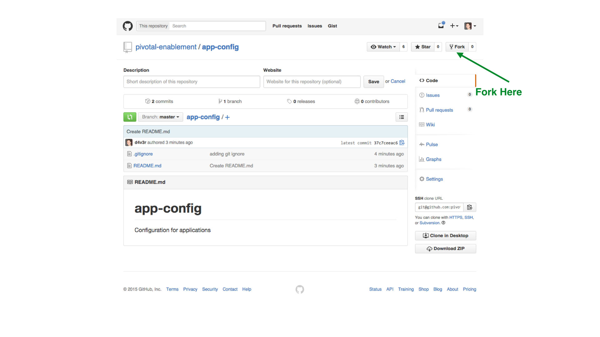
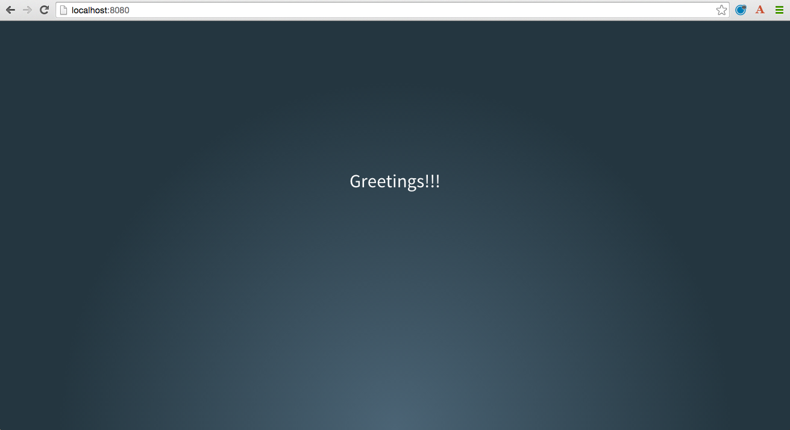

# Spring Cloud Config


## Requirements

[Lab Requirements](https://github.com/pivotal-enablement/cloud-native-app-labs/blob/master/lab-instructions/requirements.md)

## What You Will Learn

* How to set up a git repository to hold configuration data
* How to set up a config server (`config-server`) with a Git backend
* How to set up a client (`greeting-config`) to pull configuration from the `config-server`
* How to change log levels for a running application (`greeting-config`)
* How to use `@ConfigurationProperties` to capture configuration changes (`greeting-config`)
* How to use `@RefreshScope` to capture configuration changes (`greeting-config`)
* How to override configuration values by profile (`greeting-config`)
* How to use Cloud Bus to update application configuration at scale


## Exercises

### Set up the `app-config` Repo
To start, we need a repository to hold our configuration.

1) Fork the configuration repo to your account.  Browse to: https://github.com/pivotal-enablement/app-config.  Then fork the repo.


2) GitHub displays your new fork. Copy the HTTPS clone URL from your fork.

3) Open a new terminal window and clone the fork you just created:

```bash
$ git clone <Your fork of the app-config repo - HTTPS clone URL>
$ cd app-config
```

Notice that this repository is basically empty. This repository will be the source of configuration data.

### Set up the `cloud-native-app-labs` Repo
1) Fork the labs repo to your account.  Browse to: https://github.com/pivotal-enablement/cloud-native-app-labs.  Then fork the repo.

2) GitHub displays your new fork. Copy the HTTPS clone URL from your fork.

3) Open a new terminal window.  Clone the following repo.  This contains several applications used to demonstrate cloud native architectures.  Get familiar with the sub directories.

```bash
$ git clone <Your fork of the cloud-native-app-labs repo - HTTPS clone URL>
$ cd cloud-native-app-labs
```

2) OPTIONAL STEP - Import applications into your IDE such as Spring Tool Suite (STS).  Importing projects at the `cloud-native-app-labs` level is recommended because there are several projects. Otherwise, use your favorite editor.

*STS Import Help:*

Select File > Import... Then select Maven > Existing Maven Projects. On the Import Maven Projects page, browse to your cloud-native-app-labs directory. Make
sure all projects are selected and click Finish.

### Set up `config-server`

1) Review the following file: `$CLOUD_NATIVE_APP_LABS_HOME/config-server/pom.xml`
By adding `spring-cloud-config-server` to the classpath, this application is eligible to embed a config-server.

```xml
<dependency>
    <groupId>org.springframework.cloud</groupId>
    <artifactId>spring-cloud-config-server</artifactId>
</dependency>
```
2) Review the following file:`$CLOUD_NATIVE_APP_LABS_HOME/config-server/src/main/java/io/pivotal/ConfigServerApplication.java`

```java
@SpringBootApplication
@EnableConfigServer
public class ConfigServerApplication {

    public static void main(String[] args) {
        SpringApplication.run(ConfigServerApplication.class, args);
    }
}
```
Note the `@EnableConfigServer` annotation.  That embeds the config-server.

3) Set the Github repository for the `config-server`. This will be the source of the configuration data. Edit the `$CLOUD_NATIVE_APP_LABS_HOME/config-server/src/main/resources/application.yml` file.

```yml
 server:
   port: 8888

 spring:
   cloud:
     config:
       server:
         git:
           uri: https://github.com/d4v3r/app-config.git #<-- CHANGE ME
```
Make sure to substitute your forked app-config repository. Do not use the literal above.

4) Start the `config-server`.

```bash
$ cd $CLOUD_NATIVE_APP_LABS_HOME/config-server
$ mvn clean spring-boot:run
```

Your config-server will be running locally once you see a "Started ConfigServerApplication..." message. You
will not be returned to a command prompt and must leave this window open.

5) Confirm the `config-server` is up and configured with a backing git repository by calling its restful api.  Because the returned payload is JSON, we recommend using something that will pretty-print the document.  A good tool for this is the Chrome [JSON Formatter](https://chrome.google.com/webstore/detail/json-formatter/bcjindcccaagfpapjjmafapmmgkkhgoa?hl=en) plug-in.

Open a browser window fetch the following url: http://localhost:8888/greeting-config/default

 <!-- .element: style="border:1px solid black;" -->

#### What Just Happened?

The `config-server` is a RESTful application. There are several REST based endpoints exposed to fetch configuration.

In this case, we are manually calling one of those endpoints (`/{application}/{profile}[/{label}]`) to fetch configuration.  In this case, we substituted our client application `greeting-config` as the `{application}` and the `default` profile as the `{profile}`.  We didn't specify the label to use so `master` is assumed.  Because there is no configuration in the git repository none is returned.


### Set up `greeting-config`

1) Review the following file: `$CLOUD_NATIVE_APP_LABS_HOME/greeting-config/pom.xml`
By adding `spring-cloud-starter-config` to the classpath, this application will consume configuration from the config-server.  `greeting-config` is a config client.

```xml
<dependency>
    <groupId>org.springframework.cloud</groupId>
    <artifactId>spring-cloud-starter-config</artifactId>
</dependency>
```

2) Review the `$CLOUD_NATIVE_APP_LABS_HOME/greeting-config/src/main/resources/bootstrap.yml`

```yml
spring:
  application:
    name: greeting-config
```
In the bootstrap.yml, `spring.cloud.config.uri` defines how greeting-config reaches the `config-server`. Since there is no `spring.cloud.config.uri` defined in this file, the default value of `http://localhost:8888` is used.  Notice that this is the same host and port of the `config-server` application.

3) Open a new terminal window.  Start the `greeting-config` application:

```bash
$ cd $CLOUD_NATIVE_APP_LABS_HOME/greeting-config
$ mvn clean spring-boot:run
```

4) Confirm the `greeting-config` app is up.  Browse to [http://localhost:8080](http://localhost:8080)  You should see a "Greetings!!!" message.  



#### What Just Happened?

At this point, you connected the `greeting-config` application with the `config-server`.  This can be confirmed by reviewing the logs of the `greeting-config` application.

`greeting-config` log output:
```
2015-09-18 13:48:50.147  INFO 15706 --- [lication.main()] b.c.PropertySourceBootstrapConfiguration :
Located property source: CompositePropertySource [name='configService', propertySources=[]]
```

There is still no configuration in the git repo, but at this point we have everything wired up (`greeting-config` → `config-server` → `app-config` repo) so we can add configuration parameters/values and see the effects in out client application `greeting-config`.

Configuration parameters/values will be added as we move through the lab.

5) Stop the `config-server` and `greeting-config` applications.


### Deploy the `config-server` and `greeting-config` apps to PWS
The exercises below can all be run locally, but we will deploy them to PWS.

1) Add the following to `$CLOUD_NATIVE_APP_LABS_HOME/greeting-config/src/main/resources/bootstrap.yml`.

```yml
spring:
  application:
    name: greeting-config
  cloud:  # <-- ADD NEW SECTION
    config:
      uri: ${vcap.services.config-server.credentials.uri:http://localhost:8888}
```
When defining the `spring.cloud.config.uri`, our app will first look for an environment variable (`vcap.services.config-server.credentials.uri`). If it is not present, it will try to connect to a local config-server.

2) Package and deploy the `config-server` to PWS.  The `--random-route` flag will generate a random uri for the `config-server`.  Make note of it.  You will use it in the next step. Make sure you are targeting your PWS account and execute the following from
the `config-server` directory:

```bash
$ mvn clean package
$ cf push config-server -p target/config-server-0.0.1-SNAPSHOT.jar -m 512M --random-route
```

3) Create a user-provided service.  This service connects to your `config-server` application, and exposes the values in the
`config-server` as environment variables. Make sure to use your config-server uri, not the literal below.

```bash
$ cf cups config-server -p uri
$ uri> http://config-server-sectarian-flasket.cfapps.io
```

4) Package the `greeting-config` application. Execute the following from the `greeting-config` directory:

```bash
$ mvn clean package
```

5) Deploy the `greeting-config` application to PWS, without starting the application:

```bash
$ cf push greeting-config -p target/greeting-config-0.0.1-SNAPSHOT.jar -m 512M --random-route --no-start
```
6) Bind the `config-server` service to the `greeting-config` app. This will enable the `greeting-config` app to read
configuration values from the `config-server` using environment variables.

```bash
$ cf bind-service greeting-config config-server
```

7) Restage the `greeting-config` app. The proper environment variables will be set.

```bash
$ cf restage greeting-config
```

8) Verify that the your `greeting-config` app shows "Greetings!!!" on PWS.

### Changing Logging Levels
Logging levels are reset automatically when the environment changes.

1) Start tailing logs when hitting the `/` endpoint:
```bash
$ cf logs greeting-config
```
Refresh the `greeting-config` browser window. Notice that the logs are mainly from the Router [RTR]. Next, you will set up
application-specific logging.

2) View the getGreeting() method of  `$CLOUD_NATIVE_APP_LABS_HOME/greeting-config/src/main/java/io/pivotal/greeting/GreetingController.java`
 ```java
@RequestMapping("/")
String getGreeting(Model model){

  logger.debug("Adding greeting");
  model.addAttribute("msg", "Greetings!!!");

  if(greetingProperties.isDisplayFortune()){
    logger.debug("Adding fortune");
    model.addAttribute("fortune", fortuneService.getFortune());
  }

  //resolves to the greeting.vm velocity template
  return "greeting";
}
```
We want to see these debug messages.

3) View the output of the config-server.  Use your `config-server` url, not the literal below.

```bash
$ curl http://config-server-sectarian-flasket.cfapps.io/greeting-config/cloud
{
  "name": "greeting-config",
  "profiles": [
    "cloud"
  ],
  "label": "master",
  "propertySources": []
}
```

4) Edit your fork of the `app-config` repo.  Create a file called `greeting-config.yml`.  Add the content below to the file and push the changes back to GitHub.
```yml
logging:
  level:
    io:
      pivotal: DEBUG

greeting:
  displayFortune: false

quoteServiceURL: http://quote-service-dev.cfapps.io/quote
```

5) While tailing the application logs, refresh the `/` endpoint.  No changes in out application logs yet.

```
$ cf logs greeting-config
```

6) View the output of the config-server.  Use your `config-server` url, not the literal below.

```bash
$ curl http://config-server-sectarian-flasket.cfapps.io/greeting-config/cloud
{
  "name": "greeting-config",
  "profiles": [
    "cloud"
  ],
  "label": "master",
  "propertySources": [
    {
      "name": "https://github.com/d4v3r/app-config.git/greeting-config.yml",
      "source": {
        "logging.level.io.pivotal": "DEBUG",
        "greeting.displayFortune": false,
        "quoteServiceURL": "http://quote-service-dev.cfapps.io/quote"
      }
    }
  ]
}
```
The value has changed!

7) Notify `greeting-config` app to pick up the new config by POSTing to the `/refresh` endpoint.  Make sure to use your url not the literal below and that you are tailing the application logs.

```bash
$ curl -X POST http://greeting-config-hypodermal-subcortex.cfapps.io/refresh
```

8) Refresh the `/` endpoint while tailing the logs.  You should see the debug line "Adding greeting"


### `@ConfigurationProperties`

`@ConfigurationProperties` are re-bound automatically when the environment changes.

1) Review `$CLOUD_NATIVE_APP_LABS_HOME/greeting-config/src/main/java/io/pivotal/greeting/GreetingProperties.java` &
`$CLOUD_NATIVE_APP_LABS_HOME/greeting-config/src/main/java/io/pivotal/greeting/GreetingController.java`
Note how the `greeting.displayFortune` is used to turn a feature on/off.
There are times when you want to turn features on/off on demand.  In this case, we want the fortune feature "on" with our greeting.  In this case, we will use `@ConfigurationProperties` to achieve this.

2) Edit your fork of the `app-config` repo.   Change `greeting.displayFortune` from `false` to `true` in the `greeting-config.yml` and push the changes back to GitHub.
```yml
logging:
  level:
    io:
      pivotal: DEBUG

greeting:
  displayFortune: true

quoteServiceURL: http://quote-service-dev.cfapps.io/quote
```
3) Notify `greeting-config` app to pick up the new config by POSTing to the `/refresh` endpoint.  Make sure to use your url not the literal below and that you are tailing the application logs.

```bash
$ curl -X POST http://greeting-config-hypodermal-subcortex.cfapps.io/refresh
```

4) Then refresh the `/` endpoint and see the fortune included.

### `@RefreshScope`
The `@ResfreshScope` annotation is used to recreate beans so they can pickup new config values.

1) Review `$CLOUD_NATIVE_APP_LABS_HOME/greeting-config/src/main/java/io/pivotal/quote/QuoteController.java` & `$CLOUD_NATIVE_APP_LABS_HOME/greeting-config/src/main/java/io/pivotal/quote/QuoteService.java`.  `QuoteService.java` uses the `@RefreshScope` annotation.  In this case, we are using a third party service to get quotes.  We want to keep our environments aligned with the third party.  So we are going to override configuration values by profile (next section).

2) In your browser, hit the `/quote-of-the-day` endpoint.  
Note where the data is being served from: `http://quote-service-dev.cfapps.io/quote`

### Override Configuration Values By Profile
1) Set the active profile - qa

```bash
$ cf set-env greeting-config SPRING_PROFILES_ACTIVE qa
$ cf restart greeting-config
```
2) Make sure the profile is set by checking the `/env` endpoint.  Under profiles `qa` should be listed.  This can be done with curl or your browser.

```bash
$ curl -i http://greeting-config-hypodermal-subcortex.cfapps.io/env
```

3) In your fork of the `app-config` repository, create a new file: `greeting-config-qa.yml`. Fill it in with the following content:

```yml
quoteServiceURL: http://quote-service-qa.cfapps.io/quote
```
Make sure to commit and push to GitHub.

4) Refresh the application configuration values

```bash
$ curl -X POST http://greeting-config-hypodermal-subcortex.cfapps.io/refresh
```

5) Refresh the `/quote-of-the-day` endpoint.  Quotes are now being served from QA.

### Cloud Bus
Refreshing multiple instances can be a challenge by  hitting the `/refresh` endpoint for multiple app instances.

Cloud Bus allows for a pub/sub notification mechanism to refresh configuration.

1) Scale the number of config client instances to 3

```
$ cf scale greeting-config -i 3
```

2) Create a RabbitMQ service instance, bind it to `greeting-config`
```bash
$ cf cs cloudamqp lemur cloud-bus
$ cf bs greeting-config cloud-bus
$ cf restart greeting-config
```

3) Include the cloud bus dependency in the  `$CLOUD_NATIVE_APP_LABS_HOME/geeting-config/pom.xml`.  _You will need to paste this in your file._
```xml
<dependency>
    <groupId>org.springframework.cloud</groupId>
    <artifactId>spring-cloud-starter-bus-amqp</artifactId>
</dependency>
```

4) Package the new artifact:
```bash
$ mvn clean package
```

5) Deploy the application
```bash
$ cf push greeting-config -p target/greeting-config-0.0.1-SNAPSHOT.jar
```

6) Observe the logs that are generated by refreshing the `/` endpoint several times in your browser.
```bash
$ cf logs greeting-config | grep GreetingController
```
All app instances are creating debug statements

7) Turn logging down.  In your fork of the `app-config` repo edit the `greeting-config.yml`
```yml
logging:
  level:
    io:
      pivotal: INFO
```

8) Notify applications to pickup the change.  Send a POST to `/bus/refresh`
```bash
$ curl -X POST http://greeting-config-hypodermal-subcortex.cfapps.io/bus/refresh
```

9) Refresh the `/` endpoint several times in your browser.  No more logs!
