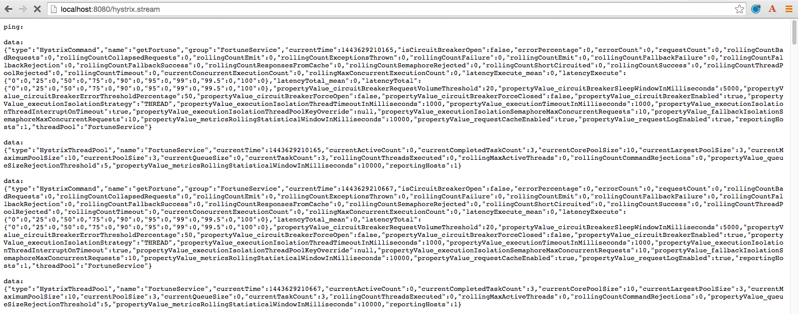
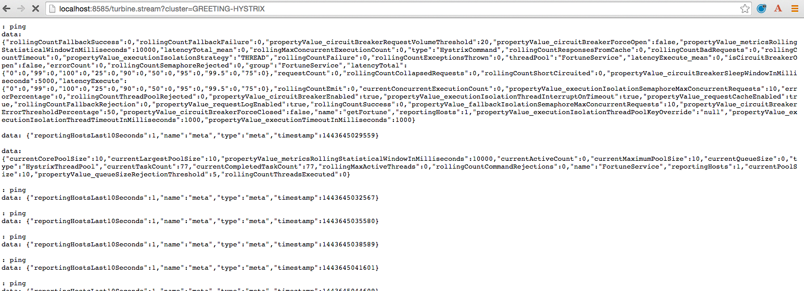

# Spring Cloud Netflix: Circuit Breaking

<!-- TOC depth:6 withLinks:1 updateOnSave:1 orderedList:0 -->

- [Spring Cloud Netflix: Circuit Breaking](#spring-cloud-netflix-circuit-breaking)
	- [Requirements](#requirements)
	- [What You Will Learn](#what-you-will-learn)
	- [Exercises](#exercises)
		- [Start the  `config-server`,  `service-registry`, and `fortune-service`](#start-the-config-server-service-registry-and-fortune-service)
		- [Set up `greeting-hystrix`](#set-up-greeting-hystrix)
		- [Set up the `greeting-hystrix` metric stream](#set-up-the-greeting-hystrix-metric-stream)
		- [Set up `hystrix-dashboard`](#set-up-hystrix-dashboard)
		- [Set up `turbine`](#set-up-turbine)
		- [Deploying to PCF](#deploying-to-pcf)
		- [Deploy `greeting-hystrix` to PCF](#deploy-greeting-hystrix-to-pcf)
		- [Deploy `turbine-amqp` to PCF](#deploy-turbine-amqp-to-pcf)
		- [Deploy `hystrix-dashboard` to PCF](#deploy-hystrix-dashboard-to-pcf)
<!-- /TOC -->

## Requirements

[Lab Requirements](https://github.com/pivotal-enablement/cloud-native-app-labs/blob/master/lab-instructions/requirements.md)

## What You Will Learn

* How to protect your application (`greeting-hystrix`) from failures or latency with the circuit breaking pattern
* How to publish circuit-breaking metrics from your application (`greeting-hystrix`)
* How to consume metric streams with the `hystrix-dashboard`
* How to aggregate multiple metric streams with `turbine`


## Exercises


### Start the  `config-server`,  `service-registry`, and `fortune-service`

1) Start the `config-server` in a terminal window.  You may have terminal windows still open from previous labs.  They may be reused for this lab.

```bash
$ cd $CLOUD_NATIVE_APP_LABS_HOME/config-server
$ mvn clean spring-boot:run
```

2) Start the `service-registry`

```bash
$ cd $CLOUD_NATIVE_APP_LABS_HOME/service-registry
$ mvn clean spring-boot:run
```

3) Start the `fortune-service`

```bash
$ cd $CLOUD_NATIVE_APP_LABS_HOME/fortune-service
$ mvn clean spring-boot:run
```


### Set up `greeting-hystrix`

1) Review the `$CLOUD_NATIVE_APP_LABS_HOME/greeting-hystrix/pom.xml` file.  By adding `spring-cloud-starter-hystrix` to the classpath this application is eligible to use circuit breakers via Hystrix.

```xml
<dependency>
    <groupId>org.springframework.cloud</groupId>
    <artifactId>spring-cloud-starter-hystrix</artifactId>
</dependency>
```

2) Review the following file: `$CLOUD_NATIVE_APP_LABS_HOME/greeting-hystrix/src/main/java/io/pivotal/GreetingHystrixApplication.java`.  Note the use of the `@EnableCircuitBreaker` annotation. This allows the application to create circuit breakers.

```java
@SpringBootApplication
@EnableDiscoveryClient
@EnableCircuitBreaker
public class GreetingHystrixApplication {


    public static void main(String[] args) {
        SpringApplication.run(GreetingHystrixApplication.class, args);
    }

}
```

3). Review the following file: `$CLOUD_NATIVE_APP_LABS_HOME/greeting-hystrix/src/main/java/io/pivotal/fortune/FortuneService.java`.  Note the use of the `@HystrixCommand`.  This is our circuit breaker.  If `getFortune()` fails, a fallback method `defaultFortune` will be invoked.

```java
@Service
public class FortuneService {

	Logger logger = LoggerFactory
			.getLogger(FortuneService.class);

	@Autowired
	@LoadBalanced
	private RestTemplate restTemplate;

	@HystrixCommand(fallbackMethod = "defaultFortune")
	public String getFortune() {
    String fortune = restTemplate.getForObject("http://fortune-service", String.class);
		return fortune;
	}

	public String defaultFortune(){
		logger.debug("Default fortune used.");
		return "This fortune is no good. Try another.";
	}


}

```

4) Open a new terminal window. Start the `greeting-hystrix`

```bash
$ cd $CLOUD_NATIVE_APP_LABS_HOME/greeting-hystrix
$ mvn clean spring-boot:run
```

5) Refresh the `greeting-hystrix` `/` endpoint.  You should get fortunes from the `fortune-service`.

6) Stop the `fortune-service`.  And refresh the `greeting-hystrix` `/` endpoint again.  The default fortune is given.

7) Restart the `fortune-service`.  And refresh the `greeting-hystrix` `/` endpoint again.  Fortunes from the `fortune-service` are back.

***What Just Happened?***
The circuit breaker tripped because the `fortune-service` was not available.  This insulates the `greeting-hystrix` application so that our users have a better user experience.

### Set up the `greeting-hystrix` metric stream

Being able to monitor the state of our circuit breakers is highly valuable, but first the `greeting-hystrix` application must expose the metrics.

This is accomplished by including the `actuator` dependency in the `greeting-hystrix` `pom.xml`.

1) Review the `$CLOUD_NATIVE_APP_LABS_HOME/greeting-hystrix/pom.xml` file.  By adding `spring-boot-starter-actuator` to the classpath this application will publish metrics at the `/hystrix.stream` endpoint.

```xml
<dependency>
	<groupId>org.springframework.boot</groupId>
	<artifactId>spring-boot-starter-actuator</artifactId>
</dependency>
```

2) Browse to [http://localhost:8080/hystrix.stream](http://localhost:8080/hystrix.stream) to review the metric stream.


### Set up `hystrix-dashboard`

Consuming the metric stream is difficult to interpret on our own.  The metric stream can be visualized with the Hystrix Dashboard.

1) Review the `$CLOUD_NATIVE_APP_LABS_HOME/hystrix-dashboard/pom.xml` file.  By adding `spring-cloud-starter-hystrix-dashboard` to the classpath this application is exposes a Hystrix Dashboard.

```xml
<dependency>
    <groupId>org.springframework.cloud</groupId>
    <artifactId>spring-cloud-starter-hystrix-dashboard</artifactId>
</dependency>
```

2) Review the following file: `$CLOUD_NATIVE_APP_LABS_HOME/hystrix-dashboard/src/main/java/io/pivotal/HystrixDashboardApplication.java`.  Note the use of the `@EnableHystrixDashboard` annotation. This creates a Hystrix Dashboard.

```java
@SpringBootApplication
@EnableHystrixDashboard
public class HystrixDashboardApplication {

    public static void main(String[] args) {
        SpringApplication.run(HystrixDashboardApplication.class, args);
    }
}
```

3) Open a new terminal window. Start the `hystrix-dashboard`

```bash
$ cd $CLOUD_NATIVE_APP_LABS_HOME/hystrix-dashboard
$ mvn clean spring-boot:run
```

4) Open a browser to [http://localhost:8686/hystrix](http://localhost:8686/hystrix)


5) Link the `hystrix-dashboard` to the `greeting-hystrix` app.  Enter `http://localhost:8080/hystrix.stream` as the stream to monitor.

6) Experiment! Refresh the `greeting-hystrix` `/` endpoint several times.  Take down the `fortune-service` app.  What does the dashboard do?  Review the [dashboard doc](https://github.com/Netflix/Hystrix/wiki/Dashboard) for an explanation on metrics.


### Set up `turbine`

Looking at individual application instances in the Hystrix Dashboard is not very useful in terms of understanding the overall health of the system. Turbine is an application that aggregates all of the relevant `/hystrix.stream` endpoints into a combined `/turbine.stream` for use in the Hystrix Dashboard.

1) Review the `$CLOUD_NATIVE_APP_LABS_HOME/turbine/pom.xml` file.  By adding `spring-cloud-starter-hystrix` to the classpath this application is eligible to use circuit breakers via Hystrix.

```xml
<dependency>
    <groupId>org.springframework.cloud</groupId>
    <artifactId>spring-cloud-starter-turbine</artifactId>
</dependency>
```

2) Review the following file: `$CLOUD_NATIVE_APP_LABS_HOME/turbine/src/main/java/io/pivotal/TurbineApplication.java`.  Note the use of the `@EnableTurbine` annotation. This creates a turbine application.

```java
@SpringBootApplication
@EnableTurbine
public class TurbineApplication {


    public static void main(String[] args) {
        SpringApplication.run(TurbineApplication.class, args);
    }

}
```

3). Review the following file: `$CLOUD_NATIVE_APP_LABS_HOME/turbine/src/main/resources/bootstrap.yml`.  `turbine.appConfig` is a list of eureka serviceIds that turbine will use to lookup instances.  `turbine.aggregator.clusterConfig` is the turbine cluster these services belong to.

```yml
spring:
  application:
    name: turbine
  cloud:
    config:
      uri: ${vcap.services.config-server.credentials.uri:http://localhost:8888}
turbine:
  aggregator:
    clusterConfig: GREETING-HYSTRIX
  appConfig: greeting-hystrix
```

4) Open a new terminal window. Start the `turbine` app

```bash
$ cd $CLOUD_NATIVE_APP_LABS_HOME/turbine
$ mvn clean spring-boot:run
```

5) Wait for the `turbine` application to register with [`service-registry`](http://localhost:8761/).

6) View the turbine stream in a browser [http://localhost:8585/turbine.stream?cluster=GREETING-HYSTRIX](http://localhost:8585/turbine.stream?cluster=GREETING-HYSTRIX)


7) Configure the [`hystrix-dashboard`](http://localhost:8686/hystrix) to consume the turbine stream.  Enter `http://localhost:8585/turbine.stream?cluster=GREETING-HYSTRIX`

8) Experiment! Refresh the `greeting-hystrix` `/` endpoint several times.  Take down the `fortune-service` app.  What does the dashboard do?

### Deploying to PCF

In PCF the classic Turbine model of pulling metrics from all the distributed Hystrix commands doesn’t work.  This is because every application has the same `hostname` (every app instance has the same url).  The problem is solved with Turbine AMQP.  Metrics are published through a message broker.  We'll use RabbitMQ.


### Deploy `greeting-hystrix` to PCF

1) Add the following dependency to the $CLOUD_NATIVE_APP_LABS_HOME/greeting-hystrix/pom.xml file. _You must edit the file._

```xml
<dependency>
    <groupId>org.springframework.cloud</groupId>
    <artifactId>spring-cloud-netflix-hystrix-amqp</artifactId>
</dependency>
```

2) Create a RabbitMQ Service Instance on PCF

```bash
$ cf create-service p-rabbitmq standard turbine-broker
```


3) Package, push and bind services for `greeting-hystrix`.
```bash
$ mvn clean package
$ cf push greeting-hystrix -p target/greeting-hystrix-0.0.1-SNAPSHOT.jar -m 512M --random-route --no-start
$ cf bind-service greeting-hystrix config-server
$ cf bind-service greeting-hystrix service-registry
$ cf bind-service greeting-hystrix turbine-broker
$ cf start greeting-hystrix
```
You can safely ignore the _TIP: Use 'cf restage' to ensure your env variable changes take effect_ message from the CLI. We can just start the `greeting-hystrix` application.

### Deploy `turbine-amqp` to PCF

1) Review the `$CLOUD_NATIVE_APP_LABS_HOME/turbine-amqp/pom.xml` file.  By adding `spring-cloud-starter-turbine-amqp` to the classpath this application is eligible to use Turbine AMQP.

```xml
<dependency>
    <groupId>org.springframework.cloud</groupId>
    <artifactId>spring-cloud-starter-turbine-amqp</artifactId>
</dependency>
```

2) Review the following file: `$CLOUD_NATIVE_APP_LABS_HOME/turbine-amqp/src/main/java/io/pivotal/TurbineApplication.java`.  Note the use of the `@EnableTurbineAmqp` annotation. This creates a turbine application.  Turbine AMQP uses `com.netflix.turbine:turbine-core:2.0.0-DP.2` which leverages Netty, so we turn off our servlet container (Tomcat).

```java
@SpringBootApplication
@EnableTurbineAmqp
public class TurbineApplication {

    public static void main(String[] args) {
		new SpringApplicationBuilder(TurbineApplication.class).web(false).run(args);
	}


}
```

3). Review the following file: `$CLOUD_NATIVE_APP_LABS_HOME/turbine-amqp/src/main/resources/bootstrap.yml`.  `turbine.appConfig` and `turbine.aggregator.clusterConfig` no longer need to be configured.

```yml
spring:
  application:
    name: turbine-amqp
  cloud:
    config:
      uri: ${vcap.services.config-server.credentials.uri:http://localhost:8888}
```


4) Package, push and bind services for `turbine-amqp`
```bash
$ mvn clean package
$ cf push turbine-amqp -p target/turbine-amqp-0.0.1-SNAPSHOT.jar --random-route -m 512M --no-start
$ cf bind-service turbine-amqp turbine-broker
$ cf start turbine-amqp
```
You can safely ignore the _TIP: Use 'cf restage' to ensure your env variable changes take effect message from the CLI._ We can just start the `turbine-amqp` application.

### Deploy `hystrix-dashboard` to PCF

1) Package, and push `hystrix-dashboard`
```bash
$ mvn clean package
$ cf push hystrix-dashboard -p target/hystrix-dashboard-0.0.1-SNAPSHOT.jar -m 512M --random-route
```

2) Configure the `hystrix-dashboard` (i.e `http://your-hystrix-url/hystrix`) to consume the turbine stream.  Enter your `turbine-amqp` url .

3) Experiment! Refresh the `greeting-hystrix` `/` endpoint several times.  Take down the `fortune-service` app.  Scale the `greeting-hystrix` app.  What does the dashboard do?
