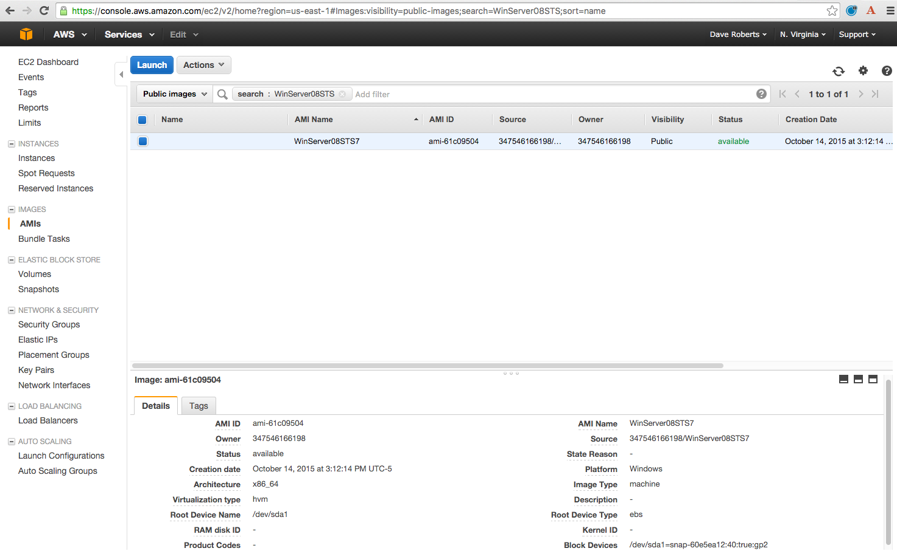

# Windows VM

A Windows VM is available to complete the labs.

## Windows VM AMI Details

1) User must have access to an AWS account (can run from any account)

2) User must have an existing key pair in the account or create one

3) The AMI can be found be searching for `WinServer08STS` in the EC2 Dashboard.  Must be in the N. Virginia region.

Launch the AMI named `WinServer08STS`. In AWS, in the EC2 dashboard, select (or search for the public image) Images > AMIs > WinServer08STS. Click Launch.

**NOTE** AMI pick the AMI with the greatest number appended to the AMI Name.  In this case, `WinServer08STS8`


4) When launching, accept defaults except:

1. Step 2: Choose an Instance Type > t2.medium (4 GB memory)

1. Step 3: Configure Instance Details > Auto-assign Public IP > Enable

1. Step 5: Tag Instance > Key: Name Value: “windows<studentname>” or “windows<studentnumber>” This will show up as the EC2 instance name

5) Launch the instance

Once the instance is running, select it in list of EC2 instances. Obtain the Public IP.

6) Credential information (user/password) will be provided by your trainer.

## Who Should Use the Windows VM?

Please consider using this VM if you have any of the following limitations:

* Your system does not meet the technical requirements
* You can't install software on your system
* You have limited network access


## Requirements

* RDP Client on your system (most operating systems ship with one)
* Network connectivity and access to reach Windows VM


## Software Installed

* All required and optional software listed as part of the [requirements](https://github.com/pivotal-enablement/cloud-native-app-labs/blob/master/lab-instructions/requirements.md).

## Best Practices

### Work Directory

As part of the VM there is a `repos` directory.  It is located at `C:\Users\Administrator\repos`.  This is where you will clone repos from GitHub.  This will be referred to as $REPOS_HOME throughout the labs.

### PowerCmd

The Windows console is very limited in the sense that it lacks tab support, search and other features one might like in a console/terminal experience.

Therefore, also installed is an alternative to the command prompt known as [PowerCmd](http://www.powercmd.com/).

We recommend using PowerCmd to execute the labs.  You can launch PowerCmd from the desktop.  It will open to your $REPOS_HOME` directory.


#### Use Labeled Tabs

As part of the labs you will be starting many processes.  Organizing the processes with tabs makes a ton of sense, otherwise you will have windows everywhere making it difficult to manage.

To label the tab execute the following:
```bash
title - <tab label>
```
For example, creating a tab for the `config-server`.  This is where work done with the `config-server` would take place.

