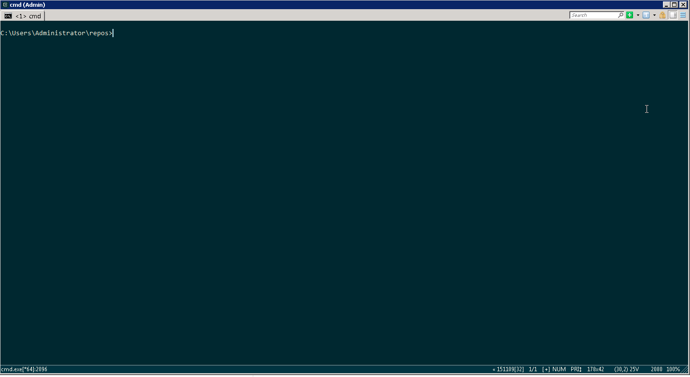
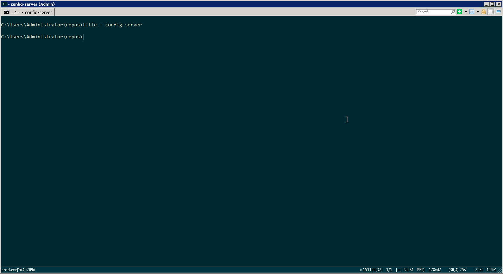

# Windows VM

A Windows VM is available to complete the labs.

## Who Should Use the Windows VM?

Please consider using this VM if you have any of the following limitations:

* Your system does not meet the technical requirements
* You can't install software on your system
* You have limited network access


## Requirements

* RDP Client on your system (most operating systems ship with one)
* Network connectivity and access to reach Windows VM


## Software Installed

* All required and optional software listed as part of the [requirements](https://github.com/pivotal-enablement/cloud-native-app-labs/blob/master/lab-instructions/requirements.md).

## Best Practices

### Work Directory

As part of the VM there is a `work directory`.  It is located at `C:\Users\Administrator\repos`.  This is where you will clone repos from GitHub.

### PowerCmd

The Windows console is very limited in the sense that it lacks tab support, search and other features one might like in a console/terminal experience.

Therefore, also installed is an alternative to the command prompt known as [PowerCmd](http://www.powercmd.com/).

We recommend using PowerCmd to execute the labs.  You can launch PowerCmd from the desktop.  It will open to your `work directory`.




#### Use Labeled Tabs

As part of the labs you will be starting many processes.  Organizing the processes with tabs makes a ton of sense, otherwise you will have windows everywhere making it difficult to manage.

To label the tab execute the following:
```bash
title - <tab label>
```
For example, creating a tab for the `config-server`.  This is where work done with the `config-server` would take place.

